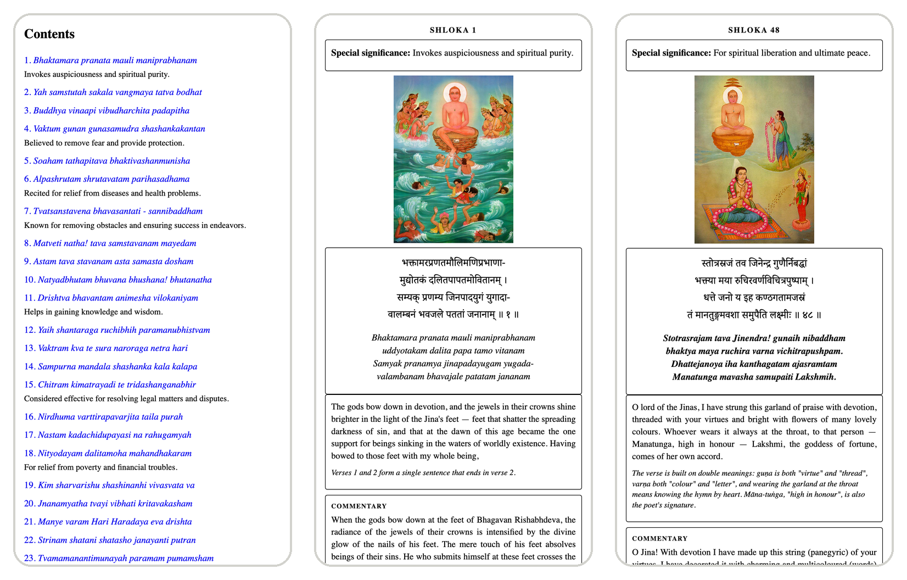

# Bhaktamara Stotra EPUB Generator

[](https://github.com/ggada/bhaktamara/actions/workflows/build-epub.yml)

A Python script that generates a beautiful EPUB e-book of the **Bhaktamara Stotra**, one of the most revered hymns in Jainism, composed by Acharya Manatunga in the 6th century CE.

## About Bhaktamara Stotra

The hymn praises Rishabhanatha, the first Tirthankara of Jainism in this time cycle. Bhaktāmara Stotra was composed sometime in the Gupta or the post-Gupta period. Devotees believe that the verses of Bhaktāmara Stotra possess magical properties, and associate a mystical diagram (yantra) with each verse.

Some also believe in the following significance of different shlokas:

- **Shloka 4**: Protection from fear
- **Shloka 6**: Relief from diseases
- **Shloka 7**: Removal of obstacles
- **Shloka 11**: Gaining knowledge and wisdom
- **Shloka 18**: Relief from poverty
- **Shloka 48**: Spiritual liberation

This script creates an e-ink optimized EPUB containing all 48 verses with:
- Sanskrit text as real Unicode Devanagari (embedded Noto Serif Devanagari font) and transliteration
- English translation made from the Sanskrit, with notes on wordplay and terms, plus the jainworld.com rendering as a commentary
- Beautiful illustrations for each shloka
- Special significance notes for key verses

## Preview

<p align="center">
  
</p>

Each verse page has the illustration, the Sanskrit in Devanagari with its transliteration, an English translation with notes on wordplay, and the JainWorld commentary:

<p align="center">
  
</p>

## Features

- Valid EPUB 3 (passes epubcheck) with an NCX table of contents for older readers
- Color illustrations at 2x the source resolution, lightly cleaned with 20% Real-ESRGAN (faces kept as painted)
- Tight, readable formatting optimized for digital reading
- Contents page listing every shloka by its opening line, with significance annotations
- Embedded images (no internet connection required)

## Setup

### Prerequisites

- [Conda](https://docs.conda.io/en/latest/miniconda.html) or [Miniconda](https://docs.conda.io/en/latest/miniconda.html)

### Installation

1. Clone this repository:
```bash
git clone <repository-url>
cd bhaktamara
```

2. Create and activate the conda environment:
```bash
conda env create -f environment.yml
conda activate bhaktamara
```

## Usage

### Generate the EPUB

```bash
python create_epub.py
```

The script will:
1. Fetch all 48 shloka pages from jainworld.com
2. Extract and process Sanskrit text, translations, and images
3. Generate `Bhaktamara_Stotra.epub` in the current directory

**Note**: The generation process takes 1-2 minutes as it respectfully fetches content with delays between requests.

### Direct Download

If you just want to read the e-book without generating it yourself, download the EPUB built automatically from the latest `main`:

**[Download Bhaktamara_Stotra.epub](https://github.com/ggada/bhaktamara/releases/download/latest/Bhaktamara_Stotra.epub)**

Transfer this file to your e-reader (Kindle, Kobo, etc.) or open it with any EPUB reader app.

### Automated builds

GitHub Actions (`.github/workflows/build-epub.yml`) builds the EPUB on every push to `main`, on pull requests, and on demand (**Actions → Build EPUB → Run workflow**). Each run:
1. Installs the pinned dependencies from `requirements.txt` and runs `create_epub.py`
2. Fails if any of the 48 shlokas is missing, then validates the book with EPUBCheck
3. Uploads `Bhaktamara_Stotra.epub` as a run artifact (kept for 90 days)
4. On `main`, also publishes it to the rolling [`latest` release](https://github.com/ggada/bhaktamara/releases/tag/latest), the download link above

## Project Structure

```
bhaktamara/
├── create_epub.py            # Main script
├── sanskrit_devanagari.txt   # Proofread Devanagari text (48 verses)
├── translation_english.txt   # English translation and notes
├── images/                   # Enhanced illustrations (illustration_NN.jpg)
├── fonts/                    # Noto Serif Devanagari + OFL license
├── tools/                    # upscale_illustrations.py (regenerates images/)
├── environment.yml           # Conda dependencies
├── Bhaktamara_Stotra.epub    # Generated e-book (git-ignored; built by GitHub Actions)
├── CLAUDE.md                 # Developer documentation
└── README.md                 # This file
```

## Troubleshooting

### Environment Issues
```bash
# Update existing environment
conda env update -f environment.yml --prune

# Recreate from scratch
conda deactivate
conda env remove -n bhaktamara
conda env create -f environment.yml
```

### Validation
To verify the generated EPUB is valid (requires [epubcheck](https://github.com/w3c/epubcheck)):
```bash
epubcheck Bhaktamara_Stotra.epub
```

## Acknowledgements

The same credits appear on the Acknowledgements page at the end of the book (`ACKNOWLEDGEMENTS` in `create_epub.py`).

- **The hymn**: composed by Ācārya Mānatuṅga; this edition follows the 48-verse Digambara recension.
- **Transliteration, commentary and illustrations**: [JainWorld](https://jainworld.jainworld.com/bhs/), a non-profit devoted to Jain philosophy and heritage. Its English rendering appears as "Commentary", with small typographic and grammatical corrections.
- **Devanagari text**: the edition transliterated by Ashok Sethi, with proofreading assistance from Surbhi Sethi, prepared with Prof. Yashwant K. Malaiya at [Colorado State University](https://www.cs.colostate.edu/~malaiya/bhaktamar.html). Its PostScript was read with [Tesseract OCR](https://github.com/tesseract-ocr/tesseract), corrected by hand, and cross-checked word by word against [Bhaktamar.in](https://www.bhaktamar.in/2020/04/BHAKTAMAR-STOTRA-SANSKRIT.html).
- **English translation and notes**: prepared for this edition from the Sanskrit with the assistance of Claude (Anthropic).
- **Illustration enhancement**: [Real-ESRGAN](https://github.com/xinntao/Real-ESRGAN) by Xintao Wang, Liangbin Xie, Chao Dong and Ying Shan (ICCV Workshops 2021, BSD-3-Clause), blended at 20% so faces stay as painted.
- **Typeface**: [Noto Serif Devanagari](https://github.com/notofonts/devanagari) by the Noto Project Authors, SIL Open Font License 1.1 (`fonts/OFL.txt`).
- **Tools**: [EbookLib](https://github.com/aerkalov/ebooklib) for EPUB generation and [EPUBCheck](https://github.com/w3c/epubcheck) for validation.

## License

This is a devotional project. The content belongs to the Jain community and is freely available for spiritual purposes. Please respect the sacred nature of these texts.

---

*Jai Jinendra* 🙏
